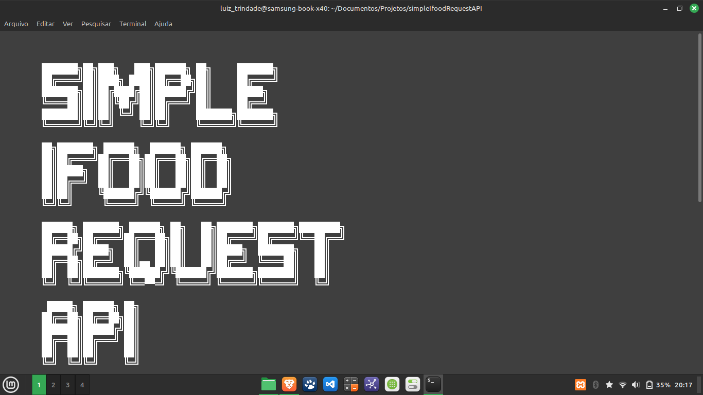
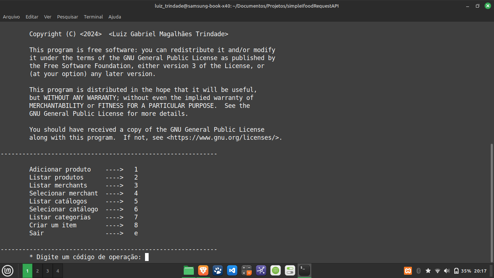

# S.I.R.A ou:

```bash
  ███████╗██╗███╗   ███╗██████╗ ██╗     ███████╗             
  ██╔════╝██║████╗ ████║██╔══██╗██║     ██╔════╝             
  ███████╗██║██╔████╔██║██████╔╝██║     █████╗               
  ╚════██║██║██║╚██╔╝██║██╔═══╝ ██║     ██╔══╝               
  ███████║██║██║ ╚═╝ ██║██║     ███████╗███████╗             
  ╚══════╝╚═╝╚═╝     ╚═╝╚═╝     ╚══════╝╚══════╝             
                                                             
  ██╗███████╗ ██████╗  ██████╗ ██████╗                       
  ██║██╔════╝██╔═══██╗██╔═══██╗██╔══██╗                      
  ██║█████╗  ██║   ██║██║   ██║██║  ██║                      
  ██║██╔══╝  ██║   ██║██║   ██║██║  ██║                      
  ██║██║     ╚██████╔╝╚██████╔╝██████╔╝                      
  ╚═╝╚═╝      ╚═════╝  ╚═════╝ ╚═════╝                       
                                                             
  ██████╗ ███████╗ ██████╗ ██╗   ██╗███████╗███████╗████████╗
  ██╔══██╗██╔════╝██╔═══██╗██║   ██║██╔════╝██╔════╝╚══██╔══╝
  ██████╔╝█████╗  ██║   ██║██║   ██║█████╗  ███████╗   ██║   
  ██╔══██╗██╔══╝  ██║▄▄ ██║██║   ██║██╔══╝  ╚════██║   ██║   
  ██║  ██║███████╗╚██████╔╝╚██████╔╝███████╗███████║   ██║   
  ╚═╝  ╚═╝╚══════╝ ╚══▀▀═╝  ╚═════╝ ╚══════╝╚══════╝   ╚═╝   
                                                             
   █████╗ ██████╗ ██╗                                        
  ██╔══██╗██╔══██╗██║                                        
  ███████║██████╔╝██║                                        
  ██╔══██║██╔═══╝ ██║                                        
  ██║  ██║██║     ██║                                        
  ╚═╝  ╚═╝╚═╝     ╚═╝                                        
```

Este programa de gerenciamento de produtos foi desenvolvido por **Luiz Gabriel Magalhães Trindade** e é licenciado sob a **GNU General Public License v3.0**. O objetivo deste software é facilitar o gerenciamento de produtos e catálogos de merchants, proporcionando uma interface simplificada e eficiente para as seguintes operações:

## Capturas de Tela




## Funcionalidades

- **Adicionar produto**: Insere novos produtos no sistema.
- **Listar produtos**: Exibe todos os produtos cadastrados.
- **Listar merchants**: Mostra uma lista de merchants disponíveis.
- **Selecionar merchant**: Permite escolher um merchant específico para gerenciar.
- **Listar catálogos**: Exibe os catálogos associados ao merchant selecionado.
- **Selecionar catálogo**: Permite a seleção de um catálogo específico.
- **Listar categorias**: Exibe as categorias de produtos disponíveis.
- **Criar um item**: Adiciona um novo item a uma categoria.
- **Sair**: Encerra o programa.

## Como usar

Ao iniciar o programa, você será apresentado a um menu com diversas opções. Digite o código da operação desejada e siga as instruções na tela. O sistema foi projetado para ser intuitivo, permitindo o gerenciamento completo de produtos e catálogos de forma simples.

## Requisitos

- Python 3.x
- Terminal compatível com UTF-8

## Instalação

1. Clone este repositório:
   ```bash
   git clone https://github.com/seu-usuario/sistema-gerenciamento-produtos.git
   ```
2. Acesse o diretório do projeto:
   ```bash
   cd sistema-gerenciamento-produtos
   ```
3. Execute o programa:
   ```bash
   python3 main.py
   ```

## Licença

Este programa é distribuído sob a **GNU General Public License v3.0**. Consulte o arquivo `LICENSE.txt` para mais detalhes.
